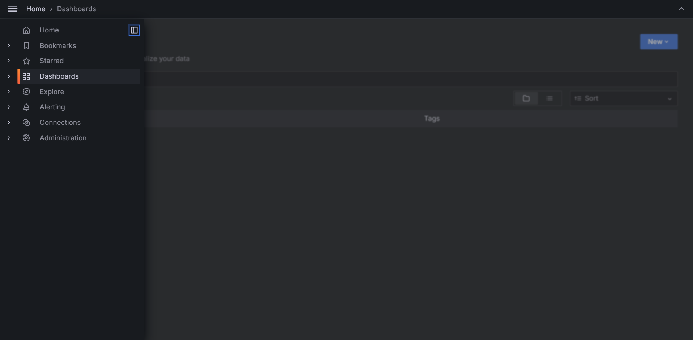
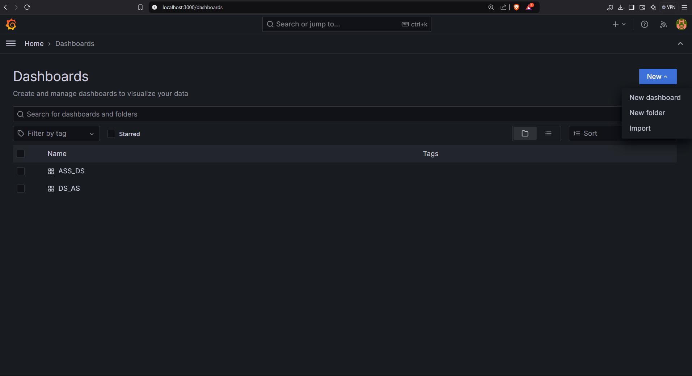
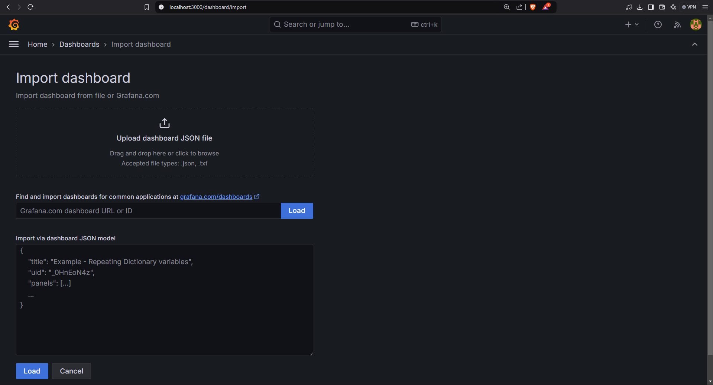

# Grafana Installation Guide

This guide will walk you through the steps to download and install Grafana on your system.

---

## Prerequisites

- Operating System: Windows, macOS, or Linux
- Web Browser: Any modern browser (Chrome, Firefox, Edge, etc.)
- Additional Requirements:
  - Admin privileges on your machine
  - `wget` or `curl` (for Linux installations)

---

## Installation Steps

### 1. Download Grafana

#### Windows
1. Go to the [Grafana Downloads Page](https://grafana.com/grafana/download).
2. Select the **Windows Installer (.msi)** file for your system.
3. Click **Download** to save the installer.

#### macOS
1. Open the [Grafana Downloads Page](https://grafana.com/grafana/download).
2. Select **macOS**.
3. Use the **Homebrew** command or download the installer:
   brew install --cask grafana


#### Linux
1. Open the [Grafana Downloads Page](https://grafana.com/grafana/download).
2. Select your Linux distribution (Debian, Ubuntu, Red Hat, etc.).
3. Follow the instructions for your OS:
   - **Debian/Ubuntu**:
     ```bash
     wget https://dl.grafana.com/enterprise/release/grafana-enterprise_10.0.1_amd64.deb
     sudo apt install ./grafana-enterprise_10.0.1_amd64.deb
     ```
   - **Red Hat/CentOS**:
     ```bash
     wget https://dl.grafana.com/enterprise/release/grafana-enterprise-10.0.1-1.x86_64.rpm
     sudo yum install grafana-enterprise-10.0.1-1.x86_64.rpm
     ```

---

### 2. Install Grafana

Follow the instructions specific to your platform:

#### Windows
1. Run the downloaded `.msi` installer.
2. Follow the setup wizard and complete the installation.

#### macOS
1. If using Homebrew, Grafana will install automatically.
2. Otherwise, open the downloaded `.pkg` file and follow the installer prompts.

#### Linux
1. Install Grafana using the package manager as shown above.
2. Start the Grafana service:
   ```bash
   sudo systemctl start grafana-server
   sudo systemctl enable grafana-server
   ```

---

### 3. Verify Installation

1. Open a web browser.
2. Go to `http://localhost:3000`.
3. Log in with the default credentials:
   - **Username:** `admin`
   - **Password:** `admin`
4. Change the password when prompted.

---

## Additional Resources

- [Official Grafana Documentation](https://grafana.com/docs/grafana/latest/)
- [Grafana Community Support](https://community.grafana.com/)

---

Feel free to reach out if you encounter any issues!
```
This guide covers installation for all major platforms and includes necessary commands and links. Let me know if you’d like to tailor it further!

```

# Build Dashboard in this project

First you need to make sure you have the file [DashBoard](DS_AS\DS_AS-1734950382240.json) that I include in my zip.
Next open Grafana in localhost, then go to DashBoard window  
Then click on New in the left-corner
then choose Import 
You will see window like this 

Now just upload the DashBoard that I gave you to have the template of my dashboard.


Second, the data in json of neon_db_data.json and next_days.json should be in the following format:\
[Historical Data](neon_db_data.json)\
[Predict Data](next_days.json)